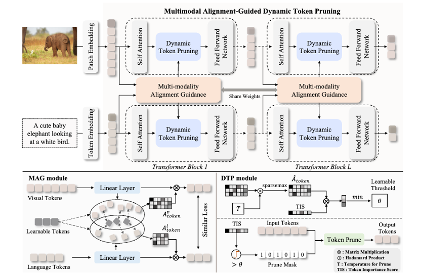

# MADTP++: Bridge the Gap between Token and Weight Pruning for Accelerating VLTs


<p align="center"> <a href="" target="_blank">[Paper]</a> 
<a href="" target="_blank">[ArXiv]</a> 
<a href="https://github.com/double125/MADTP-plus" target="_blank">[Code]</a>

Vision-Language Transformers (VLTs) have achieved remarkable success, but their computational costs pose a challenge due to the large number of input tokens and extensive model parameters. Existing VLT compression methods primarily rely on single-modality-based token pruning or coarse-grained weight pruning techniques. However, these methods face significant obstacles, such as ignoring the critical alignment of different modalities and lacking the flexibility to dynamically compress each layer for token pruning, exhibiting inevitable performance degradation due to coarse-grained weight pruning, and struggling with the simultaneous compression of both input tokens and model parameters. To address those limitations, we propose MADTP++, a novel approach that integrates custom-made token and weight pruning processes into a unified framework, achieving superior compression in both parameter counts and computational costs.




Official implementation of [MADTP++: Bridge the Gap between Token and Weight Pruning for Accelerating VLTs](https://arxiv.org/abs/). 

### What's New 🥳

* (Apri 30, 2025), we released the ```implementation``` and ```scripts``` of MADTP. (Note that ```checkpoints``` and ```logs``` will come soon.)[[Code]](https://github.com/double125/MADTP-plus") 🚩

### Installation
The code is tested on `Pytorch==1.11.0`, `cuda==11.3.1`, and `python==3.8.13`. The dependencies can be installed by:
```
conda env create -f environment.yml
```

### Supported Tasks, Models, and Datasets
Type |  Supported Tasks | Supported Models  | Supported Datasets |
--- | --- | :---: | :---: 
Multi-modal | [Visual Reasoning](https://github.com/double125/MADTP#visual-reasoning-on-the-nlvr2-dataset) | [BLIP](https://github.com/salesforce/BLIP) ([instructions](https://github.com/double125/MADTP#visual-reasoning-on-the-nlvr2-dataset)) | [NLVR2](https://lil.nlp.cornell.edu/nlvr/)
Multi-modal |[Image Caption](https://github.com/double125/MADTP#image-caption-on-the-coco-caption-dataset) | [BLIP](https://github.com/salesforce/BLIP) ([instructions](https://github.com/double125/MADTP#image-caption-on-the-coco-caption-dataset)) | [COCO Caption](https://cocodataset.org/#home)
Multi-modal |[Visual Question Answer](https://github.com/double125/MADTP#visual-question-answer-on-the-vqav2-dataset) | [BLIP](https://github.com/salesforce/BLIP) ([instructions](https://github.com/double125/MADTP#visual-question-answer-on-the-vqav2-dataset)) | [VQAv2](https://visualqa.org/)
Multi-modal |[Image-Text Retrieval](https://github.com/double125/MADTP#image-text-and-text-image-retrieval-on-the-coco-dataset) | [CLIP](https://github.com/openai/CLIP) ([instructions](https://github.com/double125/MADTP#image-text-and-text-image-retrieval-on-the-coco-dataset-with-clip)), [BLIP](https://github.com/salesforce/BLIP) ([instructions](https://github.com/double125/MADTP#image-text-and-text-image-retrieval-on-the-coco-dataset)) | [COCO](https://cocodataset.org/#home), [Flickr30k](https://shannon.cs.illinois.edu/DenotationGraph/)
Multi-modal |[Text-Image Retrieval](https://github.com/double125/MADTP#image-text-and-text-image-retrieval-on-the-coco-dataset) | [CLIP](https://github.com/openai/CLIP) ([instructions](https://github.com/double125/MADTP#image-text-and-text-image-retrieval-on-the-flickr30k-dataset-with-clip)), [BLIP](https://github.com/salesforce/BLIP) ([instructions](https://github.com/double125/MADTP#image-text-and-text-image-retrieval-on-the-flickr30k-dataset)) | [COCO](https://cocodataset.org/#home), [Flickr30k](https://shannon.cs.illinois.edu/DenotationGraph/)

### Please refer to [MADTP](https://github.com/double125/MADTP) codebase for data organization and training evaluation

### Expected Folder Structures

```
├── annotation
│   ├── answer_list.json
│   ├── coco_gt
│   │   ├── coco_karpathy_test_gt.json
│   │   └── coco_karpathy_val_gt.json
│   ├── ...
├── clip                                               
├── compress_caption_dtp.py             
├── compress_nlvr_dtp.py                  
├── compress ...    
├── configs                                             
├── data                                        
├── datasets
│   └── vision
│       ├── coco
│       ├── flickr
│       ├── NLVR2     
│       ├── ...                                                                               
├── log                                     
├── models            
├── output                                    
├── pretrained
│   ├── bert-base-uncased
│   ├── clip_large_retrieval_coco.pth
│   ├── clip_large_retrieval_flickr.pth
│   ├── ...       
├──                                                                                
├── transform                                                                           
└── utils.py                                
```

### Acknowledgments
This code is built upon <a href="https://github.com/salesforce/BLIP">BLIP</a>, <a href="https://github.com/openai/CLIP">CLIP</a>, <a href="https://github.com/sdc17/UPop">UPop</a>, and <a href=https://github.com/huggingface/pytorch-image-models/tree/main/timm>timm</a>. We thank the original authors for their open-source work.


### Citation
If you find this work useful, please consider citing the corresponding paper:
```bibtex
@article{cao2025madtp-plus,
  title={MADTP++: Bridge the Gap between Token and Weight Pruning for Accelerating VLTs},
  author={Jianjian, Cao and Chong, Yu and Peng, Ye and Tao, Chen},
  year={2025}
}
@article{cao2024madtp,
  title={MADTP: Multimodal Alignment-Guided Dynamic Token Pruning for Accelerating Vision-Language Transformer},
  author={Jianjian, Cao and Peng, Ye and Shengze, Li and Chong, Yu and Yansong, Tang and Jiwen, Lu and Tao, Chen},
  journal={IEEE Conference on Computer Vision and Pattern Recognition},
  year={2024}
}
```

